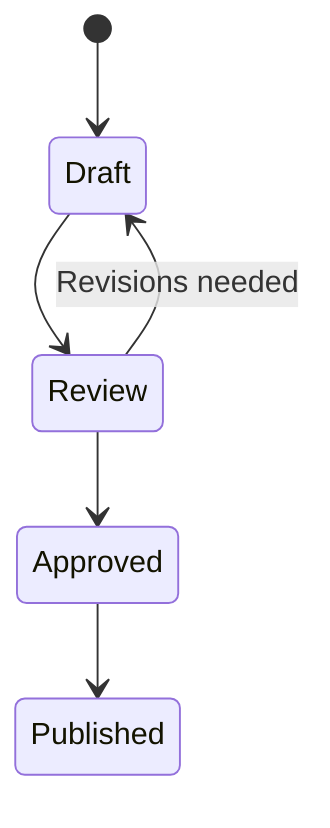

# Documentation style guide

This guide defines the standards for writing documentation across all OMG Brews
projects. Read this when creating new documents, reviewing documentation, or
resolving questions about formatting, structure, or conventions. These standards
apply to Unity game projects, web CMS projects, and shared infrastructure alike.

## TL;DR

- **File names**: `kebab-case.md`, use `README.md` for directory indexes
- **Headings**: Sentence case, never skip levels, one `#` per file
- **Scope statement**: Every doc starts with 1-3 sentences answering "what" and "who"
- **See also**: End substantial docs with related links
- **Structure**: Consistent across similar documents; sections should be self-contained
- **AI-friendly**: Explicit file paths, no ambiguous pronouns, Mermaid for structural diagrams
- **Discoverability**: Agents find docs by search and injected context — descriptive filenames and scope-statement vocabulary; whatever index exists must be accurate
- **Dates**: No dates in docs — no exceptions, task documents included. Git is the source of truth

> **Quick reference**: For essential rules only, see
> [documentation-style-quickstart.md](./documentation-style-quickstart.md).
> Read this full guide when writing new documents, resolving ambiguity, or
> needing templates.

## Table of contents

1. [Core principles](#core-principles)
2. [File organization](#file-organization)
3. [Document structure](#document-structure)
4. [Writing style](#writing-style)
5. [Markdown formatting](#markdown-formatting)
6. [Diagrams](#diagrams)
7. [Cross-referencing](#cross-referencing)
8. [AI-agent optimization](#ai-agent-optimization)
9. [Document types](#document-types)
10. [Maintenance](#maintenance)
11. [See also](#see-also)

---

## Core principles

### For humans

- **Scannable**: Use headings, lists, and tables so readers find information quickly
- **Concise**: Prefer brevity without sacrificing clarity
- **Contextual**: Explain the "why" alongside the "what"
- **Actionable**: Provide clear next steps and examples

### For AI agents

- **Predictable**: Use consistent structure across similar documents
- **Explicit**: State context directly; avoid implicit assumptions
- **Self-contained**: Minimize need for external context to understand a section
- **Machine-parseable**: Use structured formats (tables, lists) over prose where appropriate

### Shared goals

- **Accurate**: Keep documentation synchronized with code
- **Discoverable**: Optimize for search and injected context — descriptive filenames and scope statements carrying the vocabulary a searcher would use; whatever index exists must be accurate
- **Maintainable**: Write documentation that is easy to update and hard to make stale

---

## File organization

### Directory taxonomy

The standard `docs/` directory structure for OMG Brews projects. Not every project needs every directory — use what fits the project's scope.

```
docs/
├── README.md           # Categorized index of all documentation
├── architecture/       # System design, data models, ADRs
├── features/           # Feature-specific documentation
├── guides/             # How-to guides, tutorials
├── operations/         # Ports, scripts, troubleshooting
├── planning/           # Human thinking only — strategic plans, ideas, roadmaps
├── reference/          # Lookup material (libraries, dimensions)
├── setup/              # Initial setup, configuration
├── style-guides/       # Conventions (docs, code, READMEs)
├── testing/            # Test plans, testing guides
└── work/               # THE MACHINE'S DIRECTORY — files the shared devtools
                        # machine reads and writes; clause detail is in devtools'
                        # private fleet contract (not mirrored)
    ├── definition-of-done.md   [required; DOCS-ONLY block optional within it]
    ├── consumed-by.md          [required where a parent mounts the repo]
    ├── tasks/                  [required for repos on the task system]
    │   ├── README.md           [optional curation]
    │   ├── focus.md            [opt-in]
    │   ├── now/ soon/ later/ never/
    │   └── queued/ (+blocked/) [opt-in]
    ├── kaizen/                 [opt-in]
    ├── problems/               [opt-in]
    ├── handoffs/               [outbox]
    └── thoughts/               [inbox]
```

| Directory | Contents | Examples |
|-----------|----------|---------|
| `architecture/` | System design, data models, decision records | `overview.md`, `data-models.md` |
| `features/` | Documentation for implemented features | `achievements.md`, `prerequisite-graph.md` |
| `guides/` | Step-by-step how-to guides | `adding-a-new-screen.md` |
| `operations/` | Operational concerns, scripts, ports | `port-assignments.md`, `backup-procedures.md` |
| `planning/` | Strategic plans, ideas, roadmaps | `v2-improvements.md`, `ideas/` |
| `reference/` | Lookup material that changes infrequently | `libraries.md`, `game-dimensions.md` |
| `setup/` | Initial setup and configuration | `development-environment.md` |
| `style-guides/` | Coding and documentation conventions | `csharp-style-guide.md` |
| `testing/` | Test plans, coverage strategy | `test-coverage-plan.md` |
| `work/` | The machine's directory — every file and directory the shared devtools machine reads and writes | `definition-of-done.md`, `consumed-by.md`, `tasks/` (+`now/soon/later/never`, opt-in `queued/`), `kaizen/`, `problems/`, `handoffs/`, `thoughts/` |

### File naming

| Convention | Example | Usage |
|------------|---------|-------|
| `kebab-case.md` | `build-and-release.md` | All markdown files |
| `README.md` | `README.md` | Directory index files |
| `_TEMPLATE.md` | `_TEMPLATE.md` | Template files (prefixed underscore) |

Avoid `SCREAMING_SNAKE_CASE.md` for new documents. Existing files in older projects may still use this convention; migrate when convenient.

### Directory README files

Directory READMEs are optional human-facing curation, not a requirement. Where one exists, it should contain:

1. **Purpose statement**: What this directory contains
2. **Guidelines**: When to add documents here
3. **Document index** (conditional): Table listing files with descriptions

A README that exists must be accurate: every link resolves, no row describes a missing file.

| Directory type | A README helps most | Rationale |
|----------------|---------------------|-----------|
| Stable reference (`architecture/`, `style-guides/`) | Usually | Aids navigation; content rarely changes |
| Active work (`work/tasks/now/`, `work/tasks/soon/`) | Rarely | File names are descriptive; avoid maintenance burden |
| Ideas / brainstorming | Rarely | Low-friction capture is more important than indexing |

---

## Document structure

### Heading hierarchy

| Level | Usage | Example |
|-------|-------|---------|
| `#` | Document title (one per file) | `# Build and release` |
| `##` | Major sections | `## Overview` |
| `###` | Subsections | `### Android configuration` |
| `####` | Rarely needed; consider restructuring | `#### Signing keys` |

Rules:

- Never skip heading levels (no `#` followed by `###`)
- Use sentence case: "Getting started with the API" not "Getting Started With The API"
- Include blank lines before and after headings
- Keep headings concise (under 60 characters)
- One `#` title per file

### Scope statement

Every document must begin with a 1-3 sentence scope statement immediately after the title. This tells readers (human and AI) whether the document is relevant to their task.

The scope statement answers two questions:
1. **What does this document cover?**
2. **Who should read it?**

**Good:**
```markdown
# Screen navigation system

This document describes how screens are pushed, popped, and transitioned
in the game client. Read this when adding new screens, modifying transitions,
or debugging navigation issues.
```

**Bad:**
```markdown
# Screen navigation system

The navigation system was added in version 1.2 to replace the old
scene-switching approach...
```

The bad example provides history instead of scope and does not help the reader determine relevance.

### Standard sections

Use consistent section ordering based on document type:

```markdown
# Document title

Scope statement (1-3 sentences).

## Overview

Expanded context and purpose.

## [Main content sections]

Core information organized by topic.

## Key files

Reference to relevant code files (for technical docs).

## See also

- Links to related documents
```

### See also sections

Substantial documents (anything beyond a short reference or task) should end with a "See also" section linking to related docs. This creates navigable paths through the documentation and reinforces the vocabulary a searcher would use.

```markdown
## See also

- [Architecture overview](../architecture/overview.md) — System design context
- [C# style guide](../style-guides/csharp-style-guide.md) — Coding conventions
- [Build and release](../reference/build-and-release.md) — Deployment process
```

---

## Writing style

### Voice and tone

- Use **active voice**: "The manager loads the scene" not "The scene is loaded"
- Write in **present tense**: "The function returns" not "The function will return"
- Be **direct**: "Run `npm test`" not "You should run `npm test`"
- Stay **objective**: Avoid unnecessary qualifiers ("simply", "just", "easily")

### Clarity

| Avoid | Prefer |
|-------|--------|
| "This" without antecedent | Name the specific thing |
| Ambiguous pronouns | Repeat the noun for clarity |
| "the service" | "the backend API (`backend-api/`)" |
| "the config file" | "`ProjectSettings.asset`" |
| "run it" | "run `pytest tests/`" |
| "above" / "below" | Link to specific section |

```markdown
# Avoid
This is handled by the manager. It processes the data and returns it.

# Prefer
The DatabaseManager handles save-file loading. The manager reads the
SQLite database and returns structured Pack and Level objects.
```

### Acronyms and terminology

- Define acronyms on first use: "Architecture Decision Record (ADR)"
- Use consistent terminology throughout — do not alternate between synonyms
- When a project has domain terms (pack, category, phrase, level, dimple), define them in the relevant architecture doc and link to it

### File paths

Always format file paths and code references with backticks:

- File paths: `Plunk/Assets/Com.OMGBrews/Plunk/Managers/GameManager.cs`
- Directories: `content-generator/generators/`
- Commands: `npm run dev`
- Function names: `InitializeAsync()`
- Values: `"published"`, `True`, `25001`

---

## Markdown formatting

### Tables

Use tables for structured information:

```markdown
| Package | Purpose |
|---------|---------|
| UniTask | Async/await throughout |
| DOTween Pro | Screen transitions, UI effects |
```

Table guidelines:
- Include header row with separator
- Align columns consistently (left-aligned by default)
- Keep cells concise; use prose for complex information
- Tables with more than 5 columns may need restructuring

### Lists

**Unordered lists** for non-sequential items:
```markdown
- Item one
- Item two
  - Nested item (2-space indent)
- Item three
```

**Ordered lists** for sequential steps:
```markdown
1. First step
2. Second step
3. Third step
```

**Task lists** for trackable items:
```markdown
- [ ] Requirement one
- [ ] Requirement two
- [x] Completed requirement
```

List guidelines:
- Use parallel grammatical structure
- Keep items concise (one line when possible)
- Use sub-lists sparingly (max 2 levels)

### Emphasis

| Format | Usage | Example |
|--------|-------|---------|
| `**bold**` | Important terms, warnings, labels | **Required** |
| `*italic*` | Introducing terms, titles | *session state* |
| `` `code` `` | Code, file paths, commands | `GameManager.cs` |

### Block quotes

Use for callouts and warnings:

```markdown
> **Note**: This feature requires Firebase to be configured.

> **Warning**: This operation deletes player save data.
```

### Code blocks

Always specify the language for syntax highlighting:

````markdown
```csharp
public async UniTask LoadSceneAsync(string sceneName)
{
    await SceneManager.LoadSceneAsync(sceneName);
}
```
````

Common languages: `csharp`, `typescript`, `javascript`, `python`, `bash`, `json`, `yaml`, `sql`, `markdown`

Code block guidelines:
1. **Include context**: Show imports, signatures, surrounding code
2. **Add comments**: Explain non-obvious logic
3. **Keep focused**: Show only relevant code; use `// ...` for omitted sections
4. **Test examples**: Ensure code examples actually work

---

## Diagrams

### Mermaid for structural diagrams

Use Mermaid for flowcharts, sequence diagrams, entity relationships, state machines, and architecture diagrams. Mermaid provides machine-parseable semantic meaning and renders in GitHub, VS Code, and most modern viewers.

| Diagram type | Use case |
|--------------|----------|
| Flowcharts | Decision trees, process flows |
| Sequence diagrams | API calls, component interactions |
| Entity relationship | Data models, database schemas |
| State machines | Workflow states, status transitions |
| Architecture diagrams | System components and connections |

````markdown


Content moves from Draft through Review to Approved, then Published.
A reviewer can send content back to Draft for revisions.
````

### ASCII for spatial content

ASCII diagrams are appropriate for content where spatial layout is the information:

| Content type | Rationale |
|--------------|-----------|
| UI wireframes and mockups | Mermaid cannot represent spatial positioning |
| Terminal/CLI output | Showing actual console output |
| File tree structures | Directory layouts |

### Text descriptions for complex diagrams

Always include a text description alongside complex diagrams. This serves:
1. Accessibility for screen readers
2. AI agents that may not render diagram syntax

For simple diagrams (2-3 nodes, obvious meaning), a text description is optional.

---

## Cross-referencing

### Relative links

Use relative paths for all internal documentation links:

```markdown
See [Build and release](../reference/build-and-release.md) for details.

Related: [Data models](../architecture/data-models.md)
```

### Section anchors

Link to specific sections using GitHub-style anchors:

```markdown
See [Error handling](#error-handling) below.

For database setup, see [Configuration](./backend.md#configuration).
```

Anchor rules:
- Lowercase
- Spaces become hyphens
- Special characters removed

### Discoverability

Agents and humans find documents by search and by injected context, so optimize for those: descriptive kebab-case filenames, a scope statement carrying the vocabulary a searcher would use (both already standing rules), and an accurate root instruction file. Directory READMEs and `docs/README.md` are optional human-facing curation; whatever index exists must be accurate — every link resolves, no row describes a missing file.

### Bidirectional code-doc links

Reference documentation from code and vice versa:

**In documentation:**
```markdown
## Pack select screen

The screen implementation is in `Plunk/Assets/.../Screens/PackSelect/PackSelectScreenView.cs`.
See the class summary for field-level documentation.
```

**In code (as comments/docstrings):**
```csharp
/// <summary>
/// Displays available packs for selection.
/// For detailed documentation, see docs/features/pack-select.md
/// </summary>
public class PackSelectScreenView : ScreenView { }
```

#### Comment format for code-doc links

Use a short `See` comment at the top of key source files:

| Language | Format |
|----------|--------|
| TypeScript | `// See docs/architecture/service-layer.md` |
| Python | `# See docs/guides/adding-generators.md` |
| C# | `/// For detailed documentation, see docs/features/feature-name.md` (in XML summary) |

Place the comment after imports, before the main class/function definition. Only add to key structural files (services, handlers, managers) — not every file. Use repo-root-relative paths (e.g., `docs/architecture/service-layer.md` not `../../docs/architecture/service-layer.md`).

---

## AI-agent optimization

These patterns help AI agents parse, understand, and use documentation effectively. Agents have limited context windows and benefit from predictable structures, explicit information, and clear navigation.

### Progressive disclosure

Structure documents so agents can assess relevance without reading everything. Place the most important information first.

**TL;DR sections** at the start of complex documents:

```markdown
# Puzzle physics system

## TL;DR

- **What**: Marble movement, collision, and target detection
- **Where**: `Plunk/Assets/.../Screens/Puzzle/`
- **Key file**: `PuzzleBox.cs`
- **To modify**: See [Adding new elements](#adding-new-elements)
```

**Summaries before details**: Start each section with a one-sentence summary, then expand.

### Scope boundaries

Explicitly state what a document covers and does not cover:

```markdown
# Content export pipeline

This document covers the SQLite export process for game content.

**In scope**:
- Export format and schema
- Running the exporter
- Validation checks

**Out of scope** (see related docs):
- Content creation workflow -> [Content generation](./content-generation.md)
- Database schema -> [Data concepts](./data-concepts.md)
```

### Unambiguous language

| Ambiguous | Unambiguous |
|-----------|-------------|
| "the manager" | "the `GameManager` singleton" |
| "the file" | "`db-local/init-content.sql`" |
| "run it" | "run `npm test` in `backend-api/`" |
| "above" / "below" | Link to specific section |
| "this" / "that" | Name the specific entity |

### Change impact documentation

Document ripple effects for key components:

```markdown
## Modifying the Pack data model

**File**: `db-local/init-content.sql` (schema), `backend-api/src/routes/packs.ts` (API)

**If you change this model, also update**:
- `content-exporter/src/export.ts` — SQLite export schema
- `content-web/src/types/pack.ts` — TypeScript types
- `tests/packs.test.ts` — Test fixtures
- `docs/architecture/data-concepts.md` — Documentation
```

### Machine-readable patterns

Use consistent patterns that are easy to parse:

```markdown
**File**: `Managers/GameManager.cs`
**Location**: `Managers/GameManager.cs:42-58`
**Directory**: `Plunk/Assets/Com.OMGBrews/Plunk/Screens/`
**Command**: `cd backend-api && npm run dev`
**Default**: `"sqlite:///data/game.db"`
```

### Structural consistency

Use consistent structures across similar documents. When documenting features, follow the same section order. When documenting architecture components, use the same headings. AI agents learn patterns and work more effectively when structure is predictable.

### Canonical terminology

Use consistent terms throughout a project. Define a glossary for documents with domain-specific language:

```markdown
## Glossary

| Term | Definition |
|------|------------|
| **Pack** | A purchasable collection of categories in the game |
| **Category** | A themed group of phrases within a pack |
| **Phrase** | A mystery phrase that players reveal by finding search words |
| **Workflow state** | One of: draft, review, approved, published |

**Usage**: Always use "pack" (not "collection" or "bundle") when referring
to the top-level content grouping.
```

### Decision records

Document why decisions were made. This prevents agents from suggesting changes that were already considered and rejected:

```markdown
### Why SQLite instead of a server database

**Decision**: Use SQLite for local game data.

**Context**: Single-player mobile game with read-only content data.

**Alternatives considered**:
- PostgreSQL: Requires server process, overkill for read-only mobile data
- PlayerPrefs only: No relational queries, poor for structured content

**Rationale**: SQLite ships with the app, requires zero configuration,
and handles the read-heavy workload efficiently.
```

### Anti-patterns and warnings

Explicitly document what NOT to do:

```markdown
## Common pitfalls

### Scene loading

**Do not** load scenes synchronously:
```csharp
// Wrong — blocks the main thread
SceneManager.LoadScene("GameScene");
```

**Do** use async loading with UniTask:
```csharp
// Correct — non-blocking
await SceneManager.LoadSceneAsync("GameScene");
```
```

---

## Document types

> **Templates**: Copy-paste-ready templates for common document types are in
> [`docs/templates/`](./templates/). Delete the HTML comments and fill
> in your content.

### Architecture documents

Located in `docs/architecture/`. Describe system design and structure.

**Template**: [`templates/architecture-doc.md`](./templates/architecture-doc.md)

```markdown
# Component name

What this component does and why it exists (scope statement).

## Overview

Expanded context.

## Technology stack

| Technology | Purpose |
|------------|---------|
| Tool | What it is used for |

## Key components

### Component one

Description and responsibilities.

## Data flow

How data moves through this component.

## Key files

| File | Purpose |
|------|---------|
| `path/to/file` | What it does |

## See also

- Links to related docs
```

### Feature documents

Located in `docs/features/`. Describe implemented features.

**Template**: [`templates/feature-doc.md`](./templates/feature-doc.md)

```markdown
# Feature name

What this feature provides (scope statement).

## Overview

User-facing description of the feature.

## How it works

Technical implementation details.

## Key files

| File | Purpose |
|------|---------|
| `path/to/file` | What it does |

## See also

- Links to related docs
```

### Architecture decision records (ADRs)

Located in `docs/architecture/`. Capture the context, decision, and consequences of significant technical choices. ADRs prevent future contributors from re-litigating settled questions and help AI agents understand why the codebase is structured the way it is.

**Template**: [`templates/adr.md`](./templates/adr.md)

```markdown
# ADR: Decision title

What decision this record captures (scope statement).

**Status**: Proposed | Accepted | Deprecated | Superseded

---

## Context

What prompted this decision.

## Decision

What was decided.

## Consequences

What follows from this decision (positive and negative).

## See also

- Links to related docs
```

### Directory READMEs

Source code directories benefit from a short `README.md` that orients developers. These are distinct from documentation directory READMEs (covered in [File organization](#file-organization)) — they describe code, not docs.

**Template**: [`templates/directory-readme.md`](./templates/directory-readme.md)

### Task documents

Located in `docs/work/tasks/`, organized into time-horizon buckets: `now/`, `soon/`, `later/`, `never/`, plus the opt-in `queued/` where the repo runs the autonomous task-queue runner.

Tasks define the **problem and desired outcome** — not the implementation plan. Leave architectural decisions and step-by-step instructions for plan mode, or for `/task-finalize`, which writes a `## Recommended solution` while its analysis is fresh.

#### The template lives inside the task-create skill

The canonical task template is `.agents/skills/task-create/_TEMPLATE.md`; repos carry no tasks-root copy. `/task-create` reads the file from inside the skill and copies it into the tasks root, so one edit there reaches every repo on the next pointer bump.

**This guide therefore does not reproduce the template.** A copy here would be a second source competing with the live one, and that is not hypothetical: the template drifted into seven variants before the 2026-07-26 convergence. The tasks-root symlink that held the convergence in place — and hq's `verify-task-template-single-source.sh`, the gate that enforced it — has since been retired; only the canonical file remains. Read it for the authoritative shape; what follows is the structure and the rules that govern it.

#### Structure

Metadata is **YAML frontmatter**, not bold metadata lines:

```markdown
---
status: not-started        # not-started | in-progress | blocked
effort: medium             # small | medium | large
priority: medium           # high | medium | low
dependencies: []           # task slugs that must land before this one
---
```

One further field, `finalized-at`, is **machine-written** — `/task-finalize` stamps the commit SHA it verified the task's claims against, and the task-queue worker diffs that SHA against `HEAD` over the scoped paths at pickup. Never fill it by hand.

The body, in order:

| Section | Required | Purpose |
|---------|----------|---------|
| `# Task title` | yes | The desired outcome, not the activity |
| `**In brief**` | yes | One short paragraph in plain language, for triage. No jargon, no file paths — including domain terms whose meaning differs from plain English. Someone who has never opened the repo should follow it |
| `## Goal` | yes | 1-3 sentences, action verb first, scannable in 5 seconds |
| `## Context` | no | What exists today, what is broken, relevant history. File paths belong here |
| `## Recommended solution` | no | Usually written by `/task-finalize`. **Advisory, not contract** — the acceptance criteria are what the work is graded on |
| `## Scope` | no | Which files and subsystems the task touches |
| `## Acceptance criteria` | yes | What must be true when done, wrapped in sentinels (below) |
| `## Stopping conditions` | yes | What "done" looks like in measurable terms — the command or observation that confirms it |
| `## Decisions` | no | Resolved questions, migrated here by `/task-finalize` |
| `## Open questions` | no | Unresolved decisions. Every one left open is a point where an agent guesses |
| `## Out of scope` | no | What this task does not include |

Headings are sentence case, like every other document — `## Open questions`, not `## Open Questions`.

#### The acceptance-criteria sentinels

The criteria list is wrapped in HTML comments that mark a machine-editable zone:

```markdown
## Acceptance criteria
<!-- AC:BEGIN — DO NOT REMOVE: /task-finalize, /task-move, and the task-queue worker parse the AC list between these sentinels. -->

- [ ] Players can view a leaderboard for each pack

<!-- AC:END -->
```

**Keep them.** `/task-finalize`, `/task-move`, `/task-status`, and the autonomous task-queue worker all parse the list between them; a file missing the sentinels will not validate or run. Edits to the criteria stay inside them.

Write the sentinel lines as anchored HTML comments at the start of a line. Prose elsewhere in a document may name `AC:BEGIN` and `AC:END` — this guide does — and parsers distinguish the two by that anchoring.

A criterion is `- [ ]` (not done) or `- [x]` (done). A third marker, `- [~]`, is used for work that is started but explicitly unfinished; it counts toward the total and never toward done, so it blocks the "finished — delete the brief" verdict that `/task-status` offers.

#### Task guidelines

- **Outcomes, not steps.** Write "players can view a leaderboard for each pack", not "create a `LeaderboardManager` class in `Managers/`".
- **Anchor code references durably.** A symbol name plus a short greppable quote outlives a bare line number, which rots with every commit. The session that reads the brief may be weeks away.
- **Open questions should stay open** at creation. "One leaderboard per level or per pack?" is good; "per-pack is a good middle ground" pre-answers it. Resolve them through `/task-finalize`, which migrates each to `## Decisions` with its answer.
- **Constraints are acceptance criteria**, not background. Must work offline, must support both platforms — these get checkboxes.
- **Delete unused optional sections** rather than leaving them empty.
- **Completed tasks are deleted.** Git history preserves them; there is no `done` status. Reprioritize by moving the file between buckets — `/task-move` for one, `/task-reprioritize` for a rebalance.
- **Slash commands**: `/task-list` (inventory), `/task-status` (liveness and closure verdicts), `/task-next` (what to work on), `/task-create`, `/task-move`, `/task-reprioritize`, `/task-audit` (validity against the codebase), `/task-finalize` (verify and resolve questions), `/task-implement` (execute in-session), `/task-queue` (the autonomous runner). They were renamed from verb-first names — `/list-tasks` → `/task-list` — in the 2026-07-26 convergence.

#### Metadata policy

**No document type includes a date, task documents included.** Task documents were the historical exception, on the reasoning that a creation date gave useful lifecycle context; the exception was removed in the 2026-07-26 convergence because a recorded date goes stale on every edit while git's does not.

Derive a task's creation date when you need it:

```bash
git log --diff-filter=A --follow --format=%cs -- <task-file>
```

`--follow` is what survives the `git mv` between buckets, and `--diff-filter=A` finds the add rather than the latest touch.

The same rule covers every other document: no created, last-updated, or "since version" lines. Use `git log --follow <file>` for a document's history. Dates naming a real event — an incident, a decision, a verification run — are content, not metadata, and belong in the prose that describes them.

### Procedure documents

Short, actionable guides for specific tasks. Located in `docs/guides/` or `docs/operations/`.

Procedures vary in structure but share common elements:

- **Scope statement**: One sentence explaining what and when
- **Prerequisites**: If setup is required (optional)
- **Main content**: Steps, commands, or reference material
- **Verification**: How to confirm success (if applicable)
- **See also**: Related links

### Reference documents

Located in `docs/reference/`. Concise lookup material with minimal prose.

Reference docs (library lists, dimension tables, port assignments) should be structured as tables. Let the data speak — minimize narrative text.

```markdown
# Library inventory

Current third-party libraries used in the project. Maintained by `/update-libraries`.

| Package | Version | Purpose |
|---------|---------|---------|
| UniTask | 2.5.0 | Async/await |
| DOTween Pro | 1.2.765 | Animation |
```

---

## Maintenance

### Keeping documentation current

- Update docs when changing related code
- Review documentation during code reviews
- Delete obsolete documentation rather than leaving stale content
- Use `/audit-and-fix doc-quality` to periodically verify accuracy across the project — with `--path docs` in repos without tracker opt-in, and `Tools/check-markdown-links.sh` for link integrity

### What to check during review

1. **Accuracy**: Does it match current implementation?
2. **Completeness**: Are there gaps in coverage?
3. **Clarity**: Can a newcomer understand it?
4. **AI-friendliness**: Is context explicit? Structure consistent?

### Versioning

- Documentation lives with code in the same repository
- Major changes should be noted in commit messages
- The shared style guide lives in `devtools/` and is available to all projects via the devtools submodule

---

## See also

- [Documentation style quickstart](./documentation-style-quickstart.md) — Essential rules only
- [Document templates](./templates/) — Copy-paste-ready templates for common document types
- [Secrets in workflows](./secrets-in-workflows.md) — GitHub Actions secrets handling
