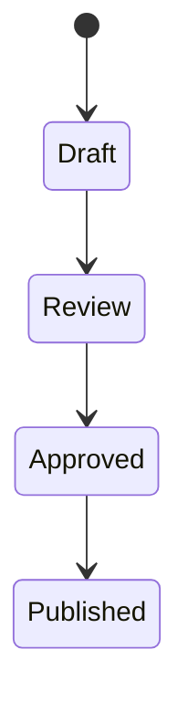

# Documentation style quickstart

Essential rules for writing documentation across OMG Brews projects. Load this
for daily reference; see
[documentation-style-guide.md](./documentation-style-guide.md) for detailed
explanations, templates, and edge cases.

## Core rules

| Rule | Convention |
|------|------------|
| File names | `kebab-case.md` |
| Headings | Sentence case ("Getting started" not "Getting Started"), one `#` per file |
| Code blocks | Always specify language (`csharp`, `typescript`, `bash`, etc.) |
| Links | Relative paths, end substantial docs with "See also" section |
| Dates | No dates in docs — **no exceptions**, task documents included. Derive them from git |

## Scope statement (required)

Every document must start with a 1-3 sentence scope statement after the title:

```markdown
# Screen navigation system

This document describes how screens are pushed, popped, and transitioned
in the game client. Read this when adding new screens or debugging navigation.
```

The scope statement answers: **What does this cover?** and **Who should read it?**

## File paths and references

Be explicit. Avoid ambiguous references:

| Avoid | Use instead |
|-------|-------------|
| "the manager" | "the `GameManager` singleton" |
| "the config file" | "`backend-api/.env`" |
| "run it" | "run `npm test` in `backend-api/`" |
| "above" / "below" | Link to specific section |

## Diagrams

Use **Mermaid** for structural diagrams (flowcharts, sequences, ER diagrams, state machines). **ASCII** is acceptable for UI mockups, terminal output, and file trees. Include a text description for complex diagrams:

````markdown


Content moves from Draft through Review to Approved, then Published.
````

## Task document format

Tasks live in `docs/work/tasks/` in time-horizon buckets (`now/`, `soon/`, `later/`, `never/`), plus the opt-in `queued/` where the repo runs the autonomous task-queue runner. Each follows the canonical `_TEMPLATE.md` inside the `task-create` skill — repos carry no tasks-root copy. The template once sat at `<tasks>/_TEMPLATE.md` behind a symlink, and that copy-point is how it drifted into seven variants before the 2026-07-26 convergence; the canonical file inside the skill alone is what holds the convergence in place now.

Metadata is YAML frontmatter, not bold lines:

```markdown
---
status: not-started        # not-started | in-progress | blocked
effort: medium             # small | medium | large
priority: medium           # high | medium | low
dependencies: []           # task slugs that must land first
---

# Task title

**In brief**: One short paragraph in plain language, for triage — what is wrong
or missing, why it matters, where it stands. No jargon, no file paths. Someone
who has never opened the repo should understand it.

## Goal

1-3 sentences: what and why. Start with an action verb.

## Acceptance criteria
<!-- AC:BEGIN — DO NOT REMOVE: /task-finalize, /task-move, and the task-queue worker parse the AC list between these sentinels. -->

- [ ] Describe outcomes, not implementation steps

<!-- AC:END -->

## Stopping conditions

What "done" looks like in measurable terms — the command or observation that confirms it.
```

Write outcomes ("players can view a leaderboard"), not steps ("create a LeaderboardManager class"). Delete unused optional sections (`Context`, `Recommended solution`, `Scope`, `Decisions`, `Open questions`, `Out of scope`). Completed tasks are deleted — git preserves them; there is no `done` status.

Three things the format depends on:

- **The `AC:BEGIN` / `AC:END` sentinels are load-bearing.** `/task-finalize`, `/task-move`, `/task-status`, and the task-queue worker parse the list between them, and a file missing them will not validate or run. Keep them, and keep edits to the criteria inside them.
- **There is no `Created` field**, and no date line of any kind. A recorded date goes stale on every edit; git's does not. Derive it when needed: `git log --diff-filter=A --follow --format=%cs -- <task-file>`.
- **`finalized-at` is machine-written** — `/task-finalize` stamps the commit SHA it verified the task against. Do not fill it by hand.

A criterion is `- [ ]` or `- [x]`. A third marker, `- [~]`, is used in practice for work that is started but explicitly unfinished; it counts toward the total and never toward done, so it blocks the "finished, delete the brief" verdict.

## AI-friendly checklist

Before committing documentation, verify:

- [ ] Scope statement answers "what" and "who"
- [ ] File paths are explicit (not "the file")
- [ ] No ambiguous pronouns ("this", "it") without clear antecedents
- [ ] "See also" section links to related docs
- [ ] Structural diagrams use Mermaid; UI mockups can use ASCII
- [ ] Complex diagrams have text descriptions
- [ ] No dates anywhere, task documents included — derive them from git
- [ ] Task documents use YAML frontmatter and keep the `AC:BEGIN`/`AC:END` sentinels

## See also

- [Documentation style guide](./documentation-style-guide.md) — Full guide with all rules, templates, and detailed explanations
- [Secrets in workflows](./secrets-in-workflows.md) — GitHub Actions secrets handling
